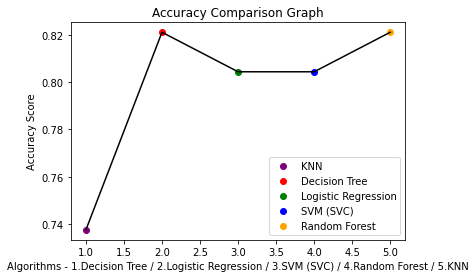

# Titanic rescue prediction using Decision Tree, SVM, Logistic Regression, Random Forest and KNN

The repository contains a basic Decision Tree for Kaggle's Titanic Challenge. The objective of this competition was to build a classification model that could successfully predict the survival or the death  of a given passenger based on a set of variables. The purpose of this repository is to document the process I went through to create a Titanic rescue prediction using Decision Tree, SVM, Logistic Regression, Random Forest and KNN. 
 
### Quick Start: 

[Check out](https://nbviewer.jupyter.org/github/alicevillar/titanic-kaggle/blob/main/Titanic_DecisionTree.ipynb
) a static version of the notebook with Jupyter NBViewer from the comfort of your web browser.

### Dependencies:  
 
* [Numpy](https://numpy.org/)
* [Pandas](https://pandas.pydata.org/)
* [SciKit-Learn](https://scikit-learn.org/)
* [Matplotlib](https://matplotlib.org/)
* [Seaborn](https://seaborn.pydata.org/)

### Approach 

* PART 1: Data Handling -> Importing Data with Pandas, cleaning data, data description.
* PART 2: Data Analysis -> Supervised ML Techniques: Decision Tree, SVM, Logistic Regression, Random Forest and KNN
* PART 3: Valuation of the Analysis -> Performance measurement + K-folds cross validation to evaluate results locally + Accuracy comparison graph

### Kaggle Competition | Titanic Machine Learning from Disaster

Kaggle's challenge provides information about a subset of the Titanic population and asks a predictive model that tells whether or not a given passenger survived. 
We are given basic explanatory variables, including passenger gender, age, passenger class, among others. More details about the competition can be found on Kaggle's [Competition Page](https://www.kaggle.com/c/titanic):

The sinking of the RMS Titanic is one of the most infamous shipwrecks in history. On April 15, 1912, during her maiden voyage, the Titanic sank after colliding with an iceberg, killing 1502 out of 2224 passengers and crew. This sensational tragedy shocked the international community and led to better safety regulations for ships. One of the reasons that the shipwreck led to such loss of life was that there were not enough lifeboats for the passengers and crew. Although there was some element of luck involved in surviving the sinking, some groups of people were more likely to survive than others, such as women, children, and the upper-class. In this contest, we ask you to complete the analysis of what sorts of people were likely to survive. In particular, we ask you to apply the tools of machine learning to predict which passengers survived the tragedy. This Kaggle Getting Started Competition provides an ideal starting place for people who may not have a lot of experience in data science and machine learning."

### Results

In this repository I documented the process to create a Titanic rescue prediction using Decision Tree, SVM, Logistic Regression, Random Forest and KNN.  To all these modeles I did a Valuation Analisis (Performance Measurement and K-Fold). I have found the accuracy score with Random forest (0.8435754189944135) and Decision Tree (0.8212290502793296).Finally, I created a graph to compare the accuracy of the different models.   
 

